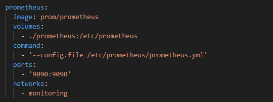
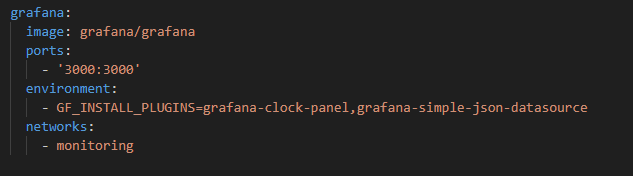
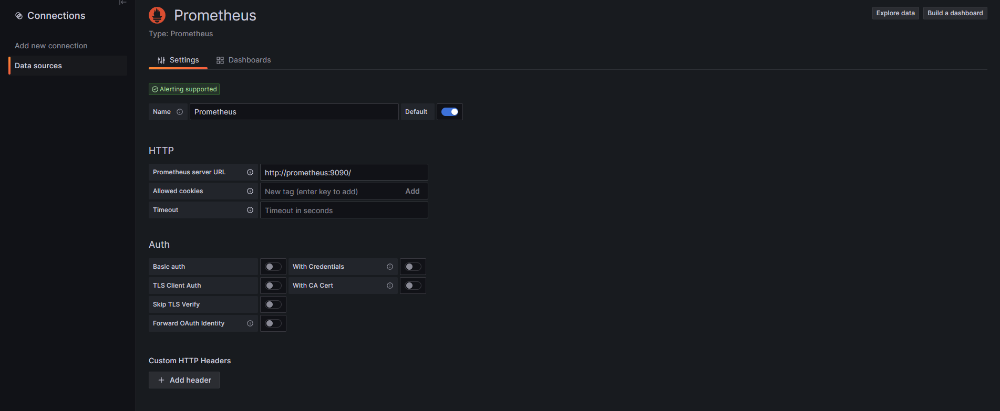
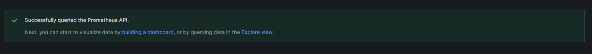
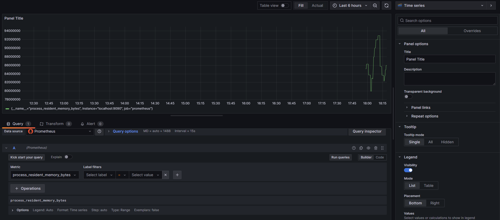
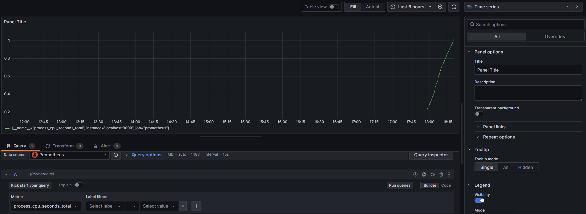

**DevOps Capstone Project**

**Part 3: Setting up Monitoring Stack**

Setting up prometheus and grafana as services using docker-compose and bringing them in same network as backend and frontend

Connecting Prometheus as data source in grafana

**Different Graphs**

